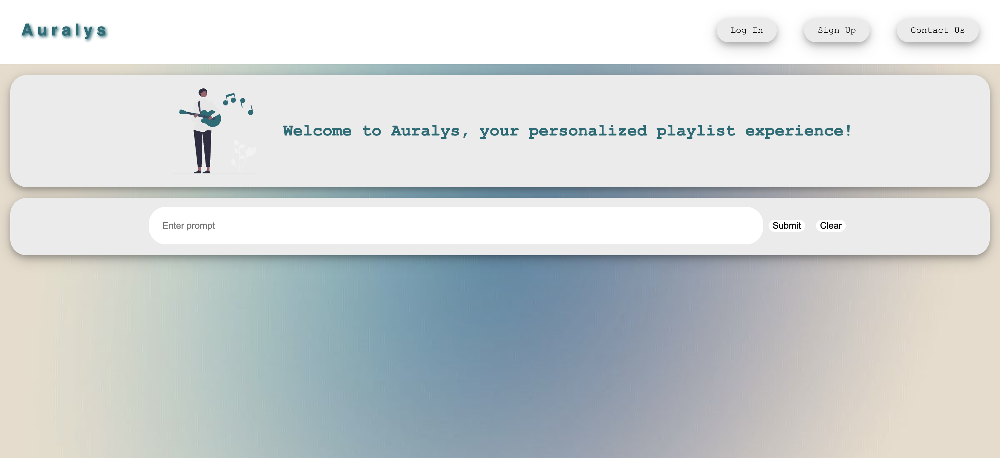
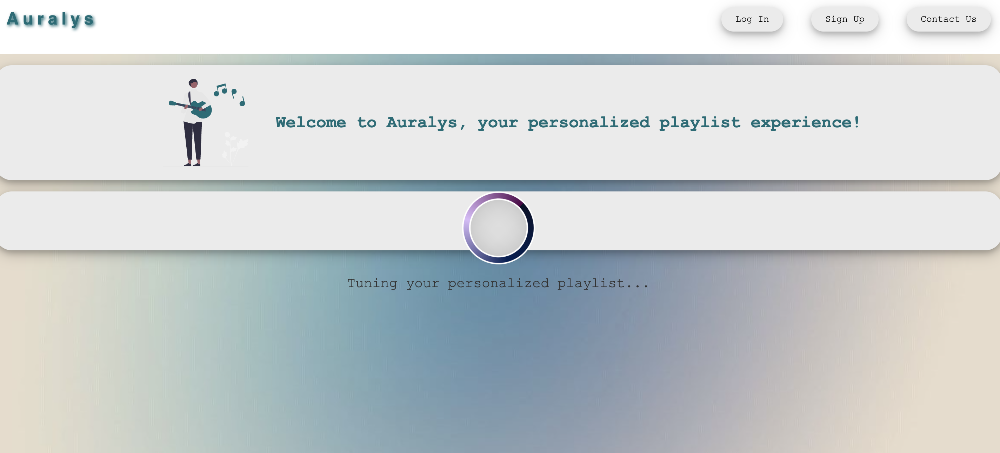
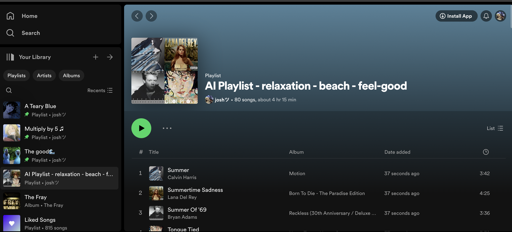

# Auralys - AI Spotify Playlist Generator Web App

- This project is soon to be deployed!

## Developed by: Joshua Matni, Ploy Wandeevong, Reni Wu, Kiana Partovi, and Matt Stanley

### Won First Place in the App Development Category for UNR's 38-hour Biggest Little Hackathon!

Auralys is an innovative web application that uses the OpenAI API and Spotify API to generate personalized Spotify playlists based on user input. The application is built with Next.js and React, providing a responsive and intuitive user interface. By leveraging these technologies, Auralys tunes into your musical tastes to create playlists that not only match your mood but also enhance your listening experience.

### Key Features

- **Personalized Playlists**: Generates playlists based on a variety of user inputs and preferences.
- **Integration with Spotify**: Seamlessly connects with Spotify to fetch songs and manage playlists.
- **User-Friendly Interface**: Provides a simple and intuitive interface for an enhanced user experience.

### How It Works

1. **User Login**: Users log in with their Spotify account.
2. **Input Preferences**: Users enter their desired mood, genre, or other musical preferences.
3. **Playlist Generation**: Auralys uses AI to generate a playlist that matches the user's preferences.
4. **Enjoy Your Music**: Listen to your personalized playlist on Spotify and discover new songs tailored to your taste.

## Example Pics!

#### Spotify Login

#### Auralys Home

#### Generating Playlist

#### Final Playlist Result

### Getting Started

Due to the Spotify API permissions, we can only register up to 25 users. If you want to use Auralys, please message us!

### Contributions

This project is the collaborative effort of a dedicated team of developers who are passionate about music and technology. Contributions to the project are welcome. Please feel free to fork the repository, make changes, and submit a pull request.

### License

Auralys is released under the MIT License. See the LICENSE file in the repository for more information.
